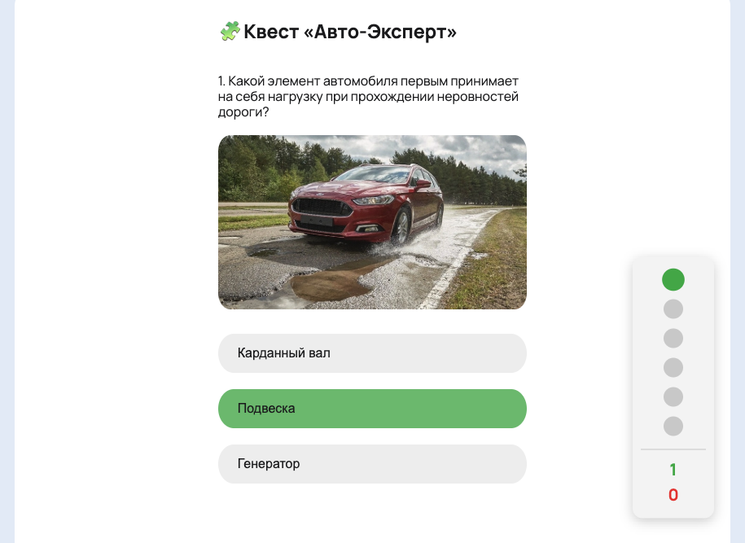

# Авто Квиз

## Описание
Структура, дизайн, логика — готовый продукт для встраивания в структуру сайта.

## Цель
Удержание аудитории на ресурсе и повышение поведенческих факторов для улучшения ранжирования в поисковых системах.

## Структура
Квиз имеет линейную структуры, где вопросы следуют один за другим. Вопросы сопровождаются визуальным сопровождением. параллельно появляется дополнительный элемент отражающий статистику ответов.

# Auto Quiz

## Discription
Structure, design, and logic—a ready-made product for integration into the website structure.

## Goal
To retain the audience on the resource and improve behavioral factors for improved search engine rankings.

## Structure
The quiz has a linear structure, with questions following one after another. The questions are accompanied by visual cues. An additional element appears at the same time, displaying the response statistics.